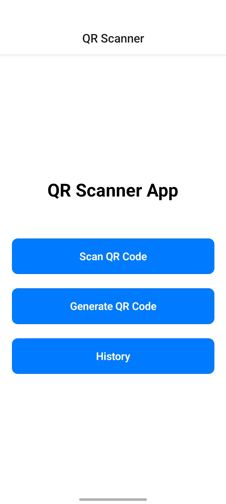
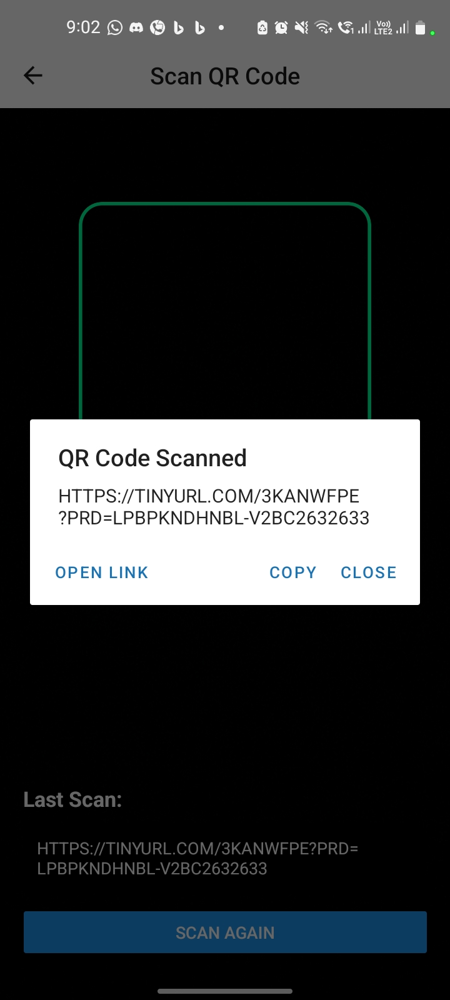
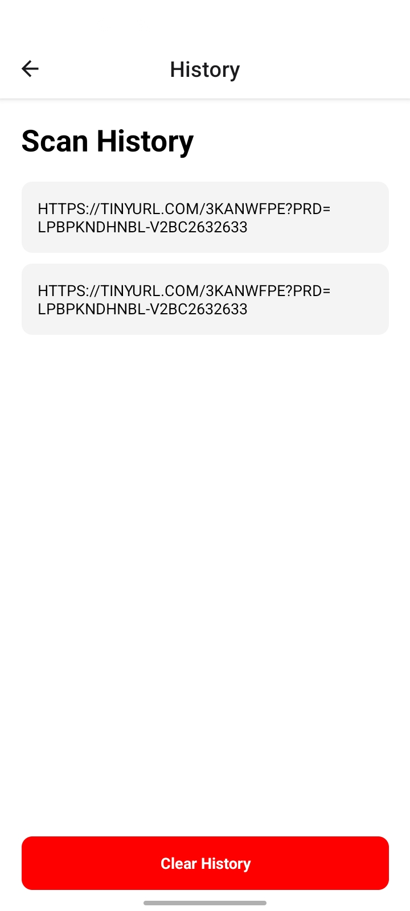

# QR Scanner App

A mobile application built with **React Native**, **Expo**, and **TypeScript** that allows users to scan QR codes using their device's camera and generate new QR codes from text or URLs.

## 📱 Features

- 📷 Scan QR codes using the device camera
- 🔲 Generate QR codes from text or URLs
- 🕘 Save scanned QR codes in history
- 📋 Copy scanned text or links
- 🌐 Open scanned URLs in the browser
- 🎨 Simple and user-friendly interface

## 🛠️ Technologies Used

- React Native
- Expo
- TypeScript
- React Navigation
- Expo Camera
- AsyncStorage
- Expo Clipboard
- React Native QRCode SVG

## 📂 Project Structure

```
QRScannerApp/
│
├── screenshots/
│
├── src/
│   ├── navigation/
│   │   └── AppNavigator.tsx
│   │
│   └── screens/
│       ├── HomeScreen.tsx
│       ├── ScannerScreen.tsx
│       ├── GeneratorScreen.tsx
│       └── HistoryScreen.tsx
│   
│
├── App.tsx
├── package.json
└── README.md
```

## 🚀 Installation

### 1. Clone the repository

```bash
git clone https://github.com/your-username/QRScannerApp.git
```

### 2. Navigate to the project

```bash
cd QRScannerApp
```

### 3. Install dependencies

```bash
npm install
```

### 4. Start the Expo development server

```bash
npx expo start
```

Scan the QR code using the **Expo Go** app or run the project on an Android/iOS emulator.

## 📸 Screenshots

### Home Screen



### QR Scanner



### QR Generator


### Scan History



## 📖 How to Use

### Scan a QR Code

1. Open the app.
2. Tap **Scan QR Code**.
3. Grant camera permission.
4. Point the camera at a QR code.
5. View, copy, or open the scanned result.

### Generate a QR Code

1. Tap **Generate QR Code**.
2. Enter text or a URL.
3. Tap **Generate**.
4. The QR code will be displayed instantly.

### View Scan History

1. Tap **Scan History**.
2. View all previously scanned QR codes.
3. Clear the history when needed.

## 🎯 Future Enhancements

- Save generated QR codes as images
- Share generated QR codes
- Flashlight support during scanning
- Dark mode
- Export scan history
- Custom QR code colors and styles

## 👨‍💻 Author
Velankini-Varshini

---
